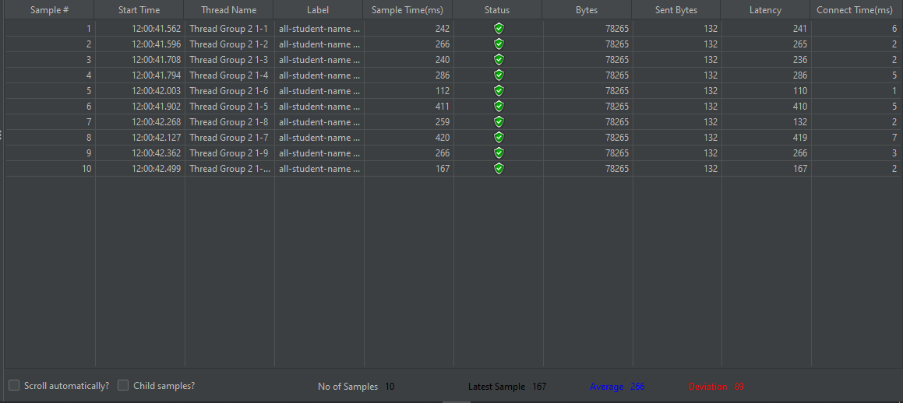

 Modul 5 

## Before optimize
- all-student
  - via intelij profiler
    
  - via GUI
    
  - via CLI
    
- all-student-name
    - via intelij profiler
      
    - via GUI
      
    - via CLI
      
- highest-gpa
    - via intelij profiler
      
    - via GUI
      
    - via CLI
      

## After optimize
- all-student
  - via intelij profiler
    
  - via GUI
    
  - via CLI
    
  Jika dibandingkan dengan sebelum optimize, terjadi penurunan average sample time(ms) pada table jmeter yang dari 72895 menjadi 16773. Hal ini karena dilakukannya refactor(optimize) terhadap method getAllStudentsWithCourses. 
- all-student-name
    - via intelij profiler
      
    - via GUI
      
    - via CLI
      
    Jika dibandingkan dengan sebelum optimize, terjadi penurunan average sample time(ms) pada table jmeter yang dari 1481 menjadi 266. Hal ini karena dilakukannya refactor(optimize) terhadap method joinStudentNames.
- highest-gpa
    - via intelij profiler
       
    - via GUI
      
    - via CLI
      
    Jika dibandingkan dengan sebelum optimize, terjadi penurunan average sample time(ms) pada table jmeter yang dari 73 menjadi 61. Hal ini karena dilakukannya refactor(optimize) terhadap method findStudentWithHighestGpa.
Setelah optimize, semua request path memiliki performa yang jauh lebih baik.

## Reflection
1. JMeter digunakan untuk pengujian secara keseluruhan dengan menunjukkan waktu dari awal request sampai diterima response. Sedangkan IntelliJ Profiler fokus pada analisis detail kinerja, seperti beban dan waktu yang digunakan oleh pemanggilan method.
2. Dengan profiling maka saya dapat mengetahui detail performa dari setiap bagian kode, seperti performa dalam setiap method yang dipanggil. Hal ini tentunya membantu saya mengetahui bagian kode/method mana yang memiliki performa yang buruk.
3. Ya sangat membantu, intelij profiler dapat memberikan informasi mendetail mengenai performa kode saya, khususnya cpu time dari method yang dipanggil. Dalam method tersebut juga ditunjukkan line mana yang menghabiskan cpu time paling banyak.
4. Tantangan yang saya hadapi seperti pengujian performa yang cenderung tidak konsisten, misal pada awal pengujian performa yang dihasilkan cenderung lebih buruk dari setelah pengujian selanjutnya. Untuk mengatasinya maka saya akan melakukan pengujian beberapa kali terlebih dahulu sampai hasil pengujian menjadi lumayan konsisten, lalu setelah itu data profiling baru dapat saya gunakan. 
5. Saya dapat mengetahui performa kode saya secara mendetail, sehingga saya dapat mengetahui bagian kode mana yang dapat dilakukan optimize dengan lebih efektif dan efisien.
6. Biasanya terjadi saat beberapa kali pengujian awal dimana JVM dan JIT belum optimal, maka saya akan melakukan pengujian ulang dan biasanya setelah itu hasilnya akan lumayan saling konsisten antara jmeter dan intelij profiler.
7. Setelah mengetahui hasil profiling, maka saya akan mencoba meng-optimize method - method yang cpu time nya lumayan tinggi. Optimize method - method tersebut dapat dilakukan misalnya dengan mengganti dengan algoritma yang berkompleksitas lebih rendah, mengganti struktur data, dan sebagainya. Dengan dilakukan run dan pengujian lagi jika tidak ada error maka perubahan tersebut tidak memengaruhi fungsionalitas keseluruhan program, selain itu juga dapat dilakukan testing juga untuk memastikan lebih lanjut.

