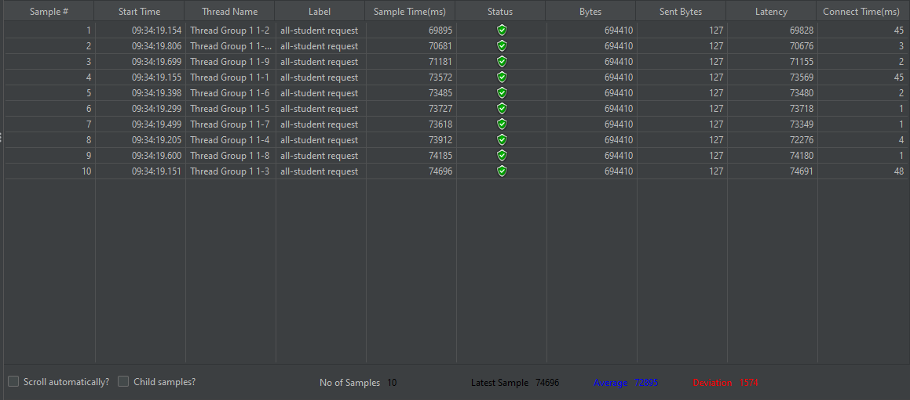
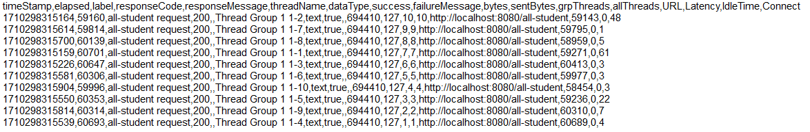
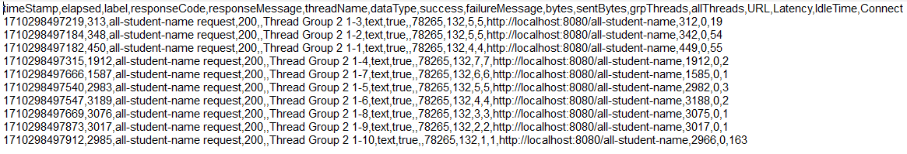
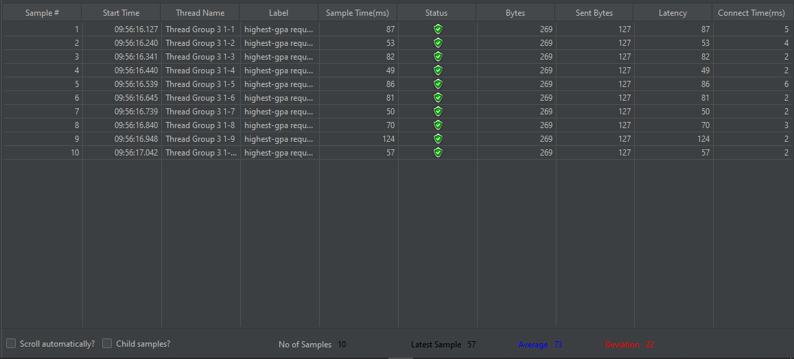

 Modul 5 

## Before optimize

- all-student
  - via GUI
    
  - via CLI
    
- all-student-name
    - via GUI
      
    - via CLI
      
- highest-gpa
    - via GUI
      
    - via CLI
      

